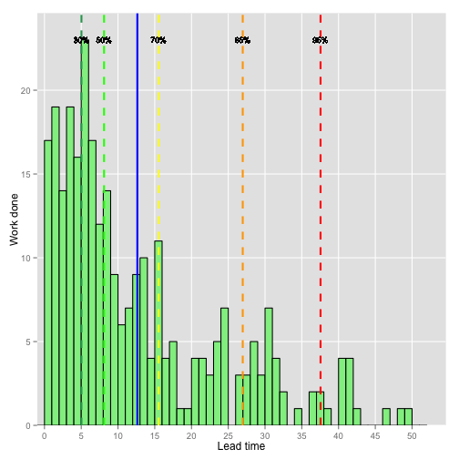

## Opportunity

In my company, software development are done with agile processes.

### Agile Metrics

- Apart from using tradicional agile metrics, we need to manage more powerful agile metrics. One of the things we are looking for is better predictability.

- Examples of metrics that can help monitoring an agile project flow are Work In Progress, Lead Time and Troughput.

  - Work in Progress: the number of items being done at a given time;
  - Lead Time: how long each item takes to get throught the process flow;
  - Throughput: how many items are completed per unit of time.

- Tracking these metrics and visualizing them in analytic charts can bring visibility to problems in the process flow and make the process more predictable.

---

## Lead Time Histogram

- A Lead Time Histogram gives an overall idea of the shape of the project lead time distribution.

- This shape can give an insigth to problems that can be ocurring in the project process.

- The Lead Time Histogram plots an histogram that shows frequency on the Y axis and lead time on the X axis.

- The percentile lines represents the percentage of the work items that took n days or less to complete, where n is the corresponding lead time value on X axis.

---

## The Lead Time Histogram App

- Currently the App is a demo that uses data of a project with two type of work items: story and defect.

- It plots the Lead Time Histogram with the percentile lines and shows a table with the average, median and the 30%, 50%, 70%, 85% and 95% lead times below the histogram.

- The type of work item to show in the histogram can be selected.

- The idea is to improve the App with new features like:

  - Selection of the project to analyse;
  - Visibility of any type of work item used by the selected project;
  - Fitting curves, like Weibull, that can help to improve predictability. 

--- &twocol .codefont

## App Histogram Example

*** =left 


```r
library(shiny)
library(ggplot2)
library(graphics)
library(MASS)
library(car)
LT <- read.csv("./LeadTime.csv", sep=",")
vLT <- c(0, 5, 10, 15, 20, 25, 30, 35, 40, 45, 50)
qLTNames <- c("30%", "50%", "70%", "85%", "95%")
qLT <- quantile(LT$LeadTime, probs=c(0.3, 0.5, 0.7, 0.85, 0.95))
avg <- mean(LT$LeadTime)
md <- median(LT$LeadTime)
vQ <- as.vector(qLT)
freqLT <- c(0, 5, 10, 15, 20, 25, 30)
qTextPos <- 23
g <- ggplot(LT) + labs(x="Lead time", y="Work done") +
        geom_histogram(aes(x=LeadTime), color="black", fill="lightgreen", binwidth=1) +
        scale_x_discrete(breaks=vLT, labels=waiver()) +
        scale_y_discrete(breaks=freqLT, labels=waiver()) +
        geom_vline(xintercept=vQ[1], color="#2ca25f", size=1, linetype=2) +
        geom_vline(xintercept=vQ[2], color="green", size=1, linetype=2) +
        geom_vline(xintercept=vQ[3], color="yellow", size=1, linetype=2) +
        geom_vline(xintercept=vQ[4], color="orange", size=1, linetype=2) +
        geom_vline(xintercept=vQ[5], color="red", size=1, linetype=2) +
        geom_vline(xintercept=avg, color="blue", size=1, linetype=1) +
        geom_text(label=qLTNames[1], x=vQ[1], y=qTextPos, size=3) +
        geom_text(label=qLTNames[2], x=vQ[2], y=qTextPos, size=3) +
        geom_text(label=qLTNames[3], x=vQ[3], y=qTextPos, size=3) +
        geom_text(label=qLTNames[4], x=vQ[4], y=qTextPos, size=3) +
        geom_text(label=qLTNames[5], x=vQ[5], y=qTextPos, size=3)
```

*** =right

 
